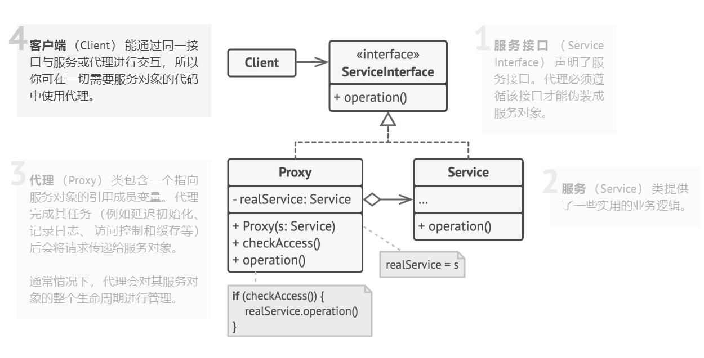

# 代理（Proxy）
## 代理模式
代理模式是一种结构型设计模式， 让你能够提供对象的替代品或其占位符。
代理对象控制着对于原对象（目标对象）的访问， 并允许在将请求提交给目标对象前后进行一些处理。



## 静态代理
静态代理是一种在编译期确定代理类的设计模式，代理类由开发者显式定义，并在运行时通过代理对象调用目标对象的方法。

静态代理通常包括以下三个部分：
- 接口：定义目标对象和代理对象共同遵守的方法规范。
- 目标类：实现接口的具体类，包含核心业务逻辑。
- 代理类：同样实现接口，但在方法中添加额外的功能。

举一个例子，放映厅播放电影，在播放电影前后会播放广告。
`ScreenRoom` 和 `MyNeighborTotoro` 都实现接口 `IMoive`。
`ScreenRoom` 对象中保存一个实现 `IMovie` 的实例，在调用 `play()` 前后进行额外的操作。
```java
public class StaticProxyTest {
    public static void main(String[] args) {
        new ScreenRoom(new MyNeighborTotoro()).play();
    }
}

public interface IMovie {
    void play();
}

class MyNeighborTotoro implements IMovie {
    String name = "My Neighbor Totoro";

    @Override
    public void play() {
        System.out.println("playing <" + name + ">");
    }
}

class ScreenRoom implements IMovie {
    IMovie movie;

    public ScreenRoom(IMovie movie) {
        this.movie = movie;
    }

    @Override
    public void play() {
        System.out.println("playing Ads");
        movie.play();
        System.out.println("playing Ads");
    }
}
```

## 动态代理
动态代理用于在运行时创建一个实现了一组接口的新类，即代理类（proxy classes）。
动态代理通过反射、`Proxy`类 和 `InvocationHandler`接口实现。

代理类是在运行时创建的类，它实现指定的接口列表，称为代理接口。
代理实例是代理类的实例。每个代理实例都有一个关联的调用处理程序对象，该对象实现接口 `InvocationHandler`。
通过代理实例的代理接口之一对代理实例的方法调用将被分派到实例的调用处理程序的 `invoke` 方法，
传递代理实例、标识调用方法的 `java.lang.reflect.Method` 对象以及包含参数的 `Object` 类型数组。
调用处理程序会根据需要处理编码的方法调用，其返回的结果将作为代理实例上的方法调用的结果返回。

动态代理的实现过程

（1）核心类 Proxy
Proxy 是 JDK 动态代理的核心类，提供了动态生成代理类的方法：
```java
public static Object newProxyInstance(ClassLoader loader, Class<?>[] interfaces, InvocationHandler h)
```
参数说明：
- `ClassLoader`：用于加载代理类。
- `interfaces`：代理类需要实现的接口。
- `InvocationHandler`：处理方法调用的逻辑。

（2）InvocationHandler 接口
用户自定义 InvocationHandler 的实现：
```java
public Object invoke(Object proxy, Method method, Object[] args) throws Throwable;
```
- `proxy`：代理对象本身。
- `method`：当前被调用的方法。
- `args`：方法的参数。

（3）代理类的生成过程
通过 `Proxy.newProxyInstance` 创建代理对象。
JVM 动态生成一个代理类（字节码文件）。
代理类会实现指定的接口，并将所有方法调用转发到 `InvocationHandler.invoke`。

示例请见 [ProxyTest](./ProxyTest.java)。

动态代理的优缺点：
- 优点
    - 灵活性：可以动态代理任何实现了接口的类。
    - 解耦：方法增强逻辑集中在 `InvocationHandler` 中。
    - 代码复用：一个代理类可代理多个目标类。
- 缺点
    - 性能开销：使用反射有一定的性能损耗。
    - 只能代理接口：JDK 动态代理只能代理实现了接口的类。

# 参考
- [Proxy Pattern - Wikipedia](https://en.wikipedia.org/wiki/Proxy_pattern)
- [代理模式 - 深入设计模式](https://refactoringguru.cn/design-patterns/proxy)
- [Proxy - JDK 17 API Doc](https://docs.oracle.com/en/java/javase/17/docs/api/java.base/java/lang/reflect/Proxy.html)